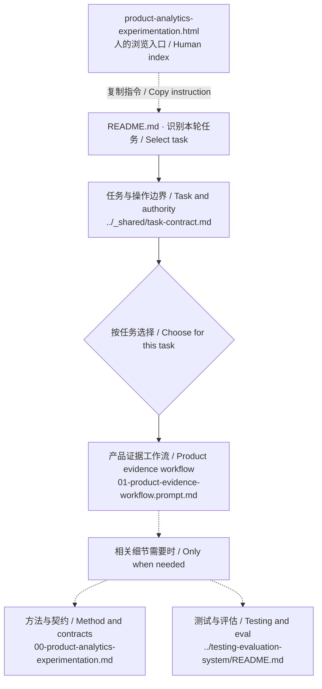

# 产品分析与实验 / Analytics and experiments — file map

Human reference, not an additional agent instruction. Generated from current routing declarations with `scripts/sync-module-maps.mjs`. The README and workflows remain authoritative.

[GitHub folder](https://github.com/CD3-github/product-practice-library/tree/main/prompts/product-analytics-experimentation) · [Visual guide](product-analytics-experimentation.html#route)

五个模式共用一个工作流文件。模式选择决定执行哪项工作，不意味着其他模式的说明完全不进入上下文。

Five modes share one workflow file. The mode controls which work is performed, not whether the other mode descriptions enter context.

实线：入口和工作流选择；虚线：按需参考。多条分支表示选项，并非全部必读。

Solid edges: entry and workflow selection. Dotted edges: conditional references. Branches are choices, not an instruction to read everything.

## Files and purpose / 文件与用途

| File | When to read |
|---|---|
| [../_shared/task-contract.md](../_shared/task-contract.md) | 分别判断交付物、所需证据与允许的操作。 Separate the deliverable, evidence needed, and permitted actions. |
| [01-product-evidence-workflow.prompt.md](01-product-evidence-workflow.prompt.md) | 选择衡量设计、衡量审查、行为分析、实验设计或实验分析。 Select measurement design, measurement audit, behavior analysis, experiment design or experiment analysis. |
| [00-product-analytics-experimentation.md](00-product-analytics-experimentation.md) | 按需查阅定义、契约与分析规则。 Read relevant definitions and analysis rules as needed. |
| [../testing-evaluation-system/README.md](../testing-evaluation-system/README.md) | 需要具体质量、可靠性或对照衡量方案时读取。 For concrete quality, reliability or comparative measurement. |

## Discovery and execution / 发现与执行

This module currently uses an explicit README entry, not an installed `SKILL.md`. Routing is guidance followed by an agent, not a deterministic dispatcher or access boundary. Reading a reference does not authorize actions or make every method applicable. HTML is a human index; this diagram is not a trace of files actually read.

当前由 README 显式进入，尚非已安装的 skill。路由是 Agent 遵循的指引，并非固定程序或权限边界。读取不等于获得执行授权，也不表示所有方法都适用。HTML 是给人阅读的索引，图并非本次真实读取记录。

[Official skill documentation](https://learn.chatgpt.com/docs/build-skills)
