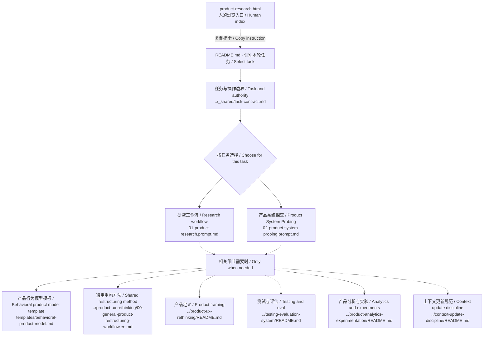

# 产品研究 / Product research — file map

Human reference, not an additional agent instruction. Generated from current routing declarations with `scripts/sync-module-maps.mjs`. The README and workflows remain authoritative.

[GitHub folder](https://github.com/CD3-github/product-practice-library/tree/main/prompts/product-research) · [Visual guide](product-research.html#files)

研究规划、来源调查或归纳使用标准研究工作流；通过真实交互理解产品行为时使用 Product System Probing。只有明确的组合任务才读取两者。

Choose the standard research workflow for planning, sources or synthesis, or Product System Probing for behavioral learning through realistic interaction. Read both only for an explicit combined request.

实线：入口和工作流选择；虚线：按需参考。多条分支表示选项，并非全部必读。

Solid edges: entry and workflow selection. Dotted edges: conditional references. Branches are choices, not an instruction to read everything.

## Files and purpose / 文件与用途

| File | When to read |
|---|---|
| [../_shared/task-contract.md](../_shared/task-contract.md) | 分别判断交付物、所需证据与允许的操作。 Separate the deliverable, evidence needed, and permitted actions. |
| [01-product-research.prompt.md](01-product-research.prompt.md) | 选择研究规划、来源检索或已有证据归纳。 Select research planning, source research, or synthesis of supplied evidence. |
| [02-product-system-probing.prompt.md](02-product-system-probing.prompt.md) | 通过规划、人工引导、Agent 直接操作或混合交互建立或更新产品行为模型。 Build or update a behavioral product model through planned, guided, agent-operated or hybrid interaction. |
| [templates/behavioral-product-model.md](templates/behavioral-product-model.md) | 用于持续记录证据、假设、边界与下一项 probe。 Use for a durable evidence ledger, hypotheses, boundaries and next probes. |
| [../product-ux-rethinking/00-general-product-restructuring-workflow.en.md](../product-ux-rethinking/00-general-product-restructuring-workflow.en.md) · [简中](../product-ux-rethinking/00-general-product-restructuring-workflow.zh-CN.md) | 需要深入处理证据、责任或结构问题时读取。 For deeper evidence, responsibility or structural questions. |
| [../product-ux-rethinking/README.md](../product-ux-rethinking/README.md) | 研究结论需要转成产品方案时读取。 When findings are ready to inform what to build. |
| [../testing-evaluation-system/README.md](../testing-evaluation-system/README.md) | 需要具体质量、可靠性或对照衡量方案时读取。 For concrete quality, reliability or comparative measurement. |
| [../product-analytics-experimentation/README.md](../product-analytics-experimentation/README.md) | 涉及用户行为或因果影响时读取。 For behavior or causal-impact questions. |
| [../context-update-discipline/README.md](../context-update-discipline/README.md) | 反馈改变当前范围或意图时读取。 When feedback changes the current scope or intent. |

## Discovery and execution / 发现与执行

This module currently uses an explicit README entry, not an installed `SKILL.md`. Routing is guidance followed by an agent, not a deterministic dispatcher or access boundary. Reading a reference does not authorize actions or make every method applicable. HTML is a human index; this diagram is not a trace of files actually read.

当前由 README 显式进入，尚非已安装的 skill。路由是 Agent 遵循的指引，并非固定程序或权限边界。读取不等于获得执行授权，也不表示所有方法都适用。HTML 是给人阅读的索引，图并非本次真实读取记录。

[Official skill documentation](https://learn.chatgpt.com/docs/build-skills)
