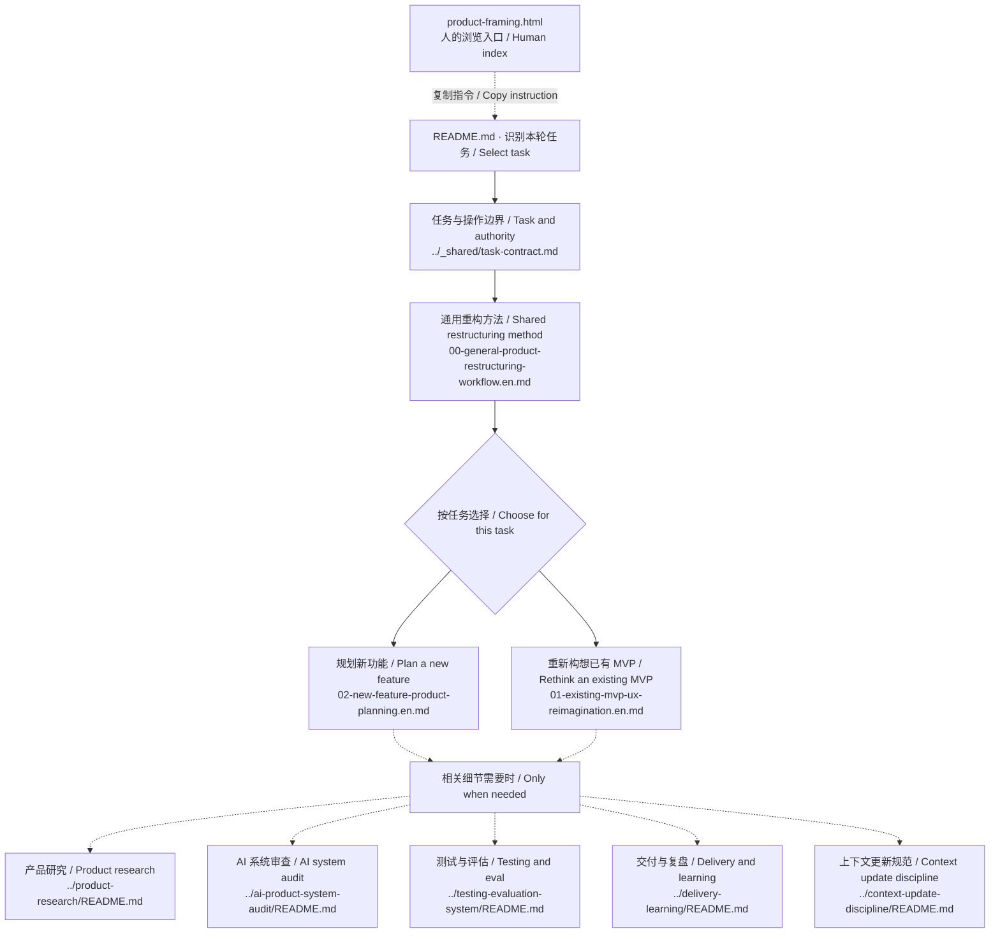

# 产品定义 / Product framing — file map

Human reference, not an additional agent instruction. Generated from current routing declarations with `scripts/sync-module-maps.mjs`. The README and workflows remain authoritative.

[GitHub folder](https://github.com/CD3-github/product-practice-library/tree/main/prompts/product-ux-rethinking) · [Visual guide](product-framing.html#files)

本页以新功能规划为起点；任务涉及已有实现重构时才转向 MVP 路线。每份工作流选择一种语言版本。

This page starts with new-feature planning. Use the MVP route only if the task includes rethinking an existing implementation. Read one language version.

实线：入口和工作流选择；虚线：按需参考。多条分支表示选项，并非全部必读。

Solid edges: entry and workflow selection. Dotted edges: conditional references. Branches are choices, not an instruction to read everything.

## Files and purpose / 文件与用途

| File | When to read |
|---|---|
| [../_shared/task-contract.md](../_shared/task-contract.md) | 分别判断交付物、所需证据与允许的操作。 Separate the deliverable, evidence needed, and permitted actions. |
| [00-general-product-restructuring-workflow.en.md](00-general-product-restructuring-workflow.en.md) · [简中](00-general-product-restructuring-workflow.zh-CN.md) | 与所选工作流一起读取对应语言的方法。 Read the matching-language method alongside the selected workflow. |
| [02-new-feature-product-planning.en.md](02-new-feature-product-planning.en.md) · [简中](02-new-feature-product-planning.zh-CN.md) | 产品模型或 MVP 尚未确定时选择。 When the product model or MVP is unsettled. |
| [01-existing-mvp-ux-reimagination.en.md](01-existing-mvp-ux-reimagination.en.md) · [简中](01-existing-mvp-ux-reimagination.zh-CN.md) | 已有实现需要重新设计体验时选择。 When an existing implementation needs a better experience. |
| [../product-research/README.md](../product-research/README.md) | 用户、替代方案或可行性仍需研究时读取。 For unresolved user, alternative or feasibility questions. |
| [../ai-product-system-audit/README.md](../ai-product-system-audit/README.md) | 接入、harness 或契约存在关键不确定性时读取。 For material wiring, harness or contract uncertainty. |
| [../testing-evaluation-system/README.md](../testing-evaluation-system/README.md) | 需要具体质量、可靠性或对照衡量方案时读取。 For concrete quality, reliability or comparative measurement. |
| [../delivery-learning/README.md](../delivery-learning/README.md) | 进入已批准的实施范围时读取。 For an approved implementation scope. |
| [../context-update-discipline/README.md](../context-update-discipline/README.md) | 反馈改变当前范围或意图时读取。 When feedback changes the current scope or intent. |

## Discovery and execution / 发现与执行

This module currently uses an explicit README entry, not an installed `SKILL.md`. Routing is guidance followed by an agent, not a deterministic dispatcher or access boundary. Reading a reference does not authorize actions or make every method applicable. HTML is a human index; this diagram is not a trace of files actually read.

当前由 README 显式进入，尚非已安装的 skill。路由是 Agent 遵循的指引，并非固定程序或权限边界。读取不等于获得执行授权，也不表示所有方法都适用。HTML 是给人阅读的索引，图并非本次真实读取记录。

[Official skill documentation](https://learn.chatgpt.com/docs/build-skills)
