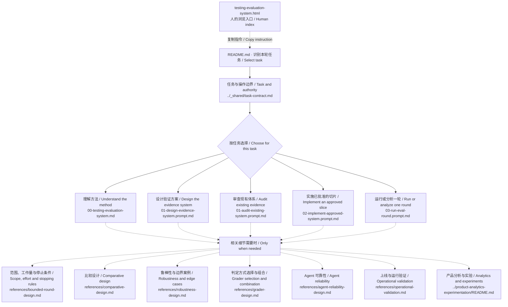

# 测试与评估 / Testing and evaluation — file map

Human reference, not an additional agent instruction. Generated from current routing declarations with `scripts/sync-module-maps.mjs`. The README and workflows remain authoritative.

[GitHub folder](https://github.com/CD3-github/product-practice-library/tree/main/prompts/testing-evaluation-system) · [Visual guide](testing-evaluation-system.html#share)

按本轮任务选文件。只做规划时读设计工作流，不进入实施或运行；明确的组合任务可以使用多个工作流。

Choose files by the requested work. A plan loads design, not implementation or a run; an explicit mixed request may use more than one workflow.

实线：入口和工作流选择；虚线：按需参考。多条分支表示选项，并非全部必读。

Solid edges: entry and workflow selection. Dotted edges: conditional references. Branches are choices, not an instruction to read everything.

## Files and purpose / 文件与用途

| File | When to read |
|---|---|
| [../_shared/task-contract.md](../_shared/task-contract.md) | 分别判断交付物、所需证据与允许的操作。 Separate the deliverable, evidence needed, and permitted actions. |
| [00-testing-evaluation-system.md](00-testing-evaluation-system.md) | 解释概念或架构时读取相关章节。 Read relevant sections for definitions and architecture. |
| [01-design-evidence-system.prompt.md](01-design-evidence-system.prompt.md) | 产出具体检查、对照、标准和首个实施切片。 Produce concrete checks, comparisons, criteria and a first slice. |
| [01-audit-existing-system.prompt.md](01-audit-existing-system.prompt.md) | 检查现有覆盖，用证据支持判断。 Inspect current coverage and substantiate findings. |
| [02-implement-approved-system.prompt.md](02-implement-approved-system.prompt.md) | 只搭建已授权的范围。 Build only the authorized scope. |
| [03-run-eval-round.prompt.md](03-run-eval-round.prompt.md) | 运行获授权的一轮，或只分析已有结果。 Execute an authorized round, or analyze saved results without rerunning. |
| [references/bounded-round-design.md](references/bounded-round-design.md) | 规划有限一轮时：验收、工作量、后续项与反馈接入。 For a finite round: acceptance, effort, deferrals and feedback. |
| [references/comparative-design.md](references/comparative-design.md) | 需要比较版本、替代方案、模块贡献或成本时。 For version, alternative, component or cost comparisons. |
| [references/robustness-design.md](references/robustness-design.md) | 输入、上下文或定制变化可能影响判断时。 For relevant input, context or customization variation. |
| [references/grader-design.md](references/grader-design.md) | 选择代码、人工或模型判断，或检查分数是否可信时。 When choosing code, human or model judgment, or validating scores. |
| [references/agent-reliability-design.md](references/agent-reliability-design.md) | 涉及工具、状态、权限与恢复时。 For stateful tools, authority and recovery. |
| [references/operational-validation.md](references/operational-validation.md) | 按风险选择影子／灰度、负载或对抗验证章节。 Select shadow/canary, load or adversarial sections by risk. |
| [../product-analytics-experimentation/README.md](../product-analytics-experimentation/README.md) | 涉及用户行为或因果影响时读取。 For behavior or causal-impact questions. |
| [01-design-or-audit.prompt.md](01-design-or-audit.prompt.md) | 把旧链接引导到设计或审查，不是额外工作流。 Redirects earlier links to design or audit; not an additional workflow. |

## Discovery and execution / 发现与执行

This module currently uses an explicit README entry, not an installed `SKILL.md`. Routing is guidance followed by an agent, not a deterministic dispatcher or access boundary. Reading a reference does not authorize actions or make every method applicable. HTML is a human index; this diagram is not a trace of files actually read.

当前由 README 显式进入，尚非已安装的 skill。路由是 Agent 遵循的指引，并非固定程序或权限边界。读取不等于获得执行授权，也不表示所有方法都适用。HTML 是给人阅读的索引，图并非本次真实读取记录。

[Official skill documentation](https://learn.chatgpt.com/docs/build-skills)
