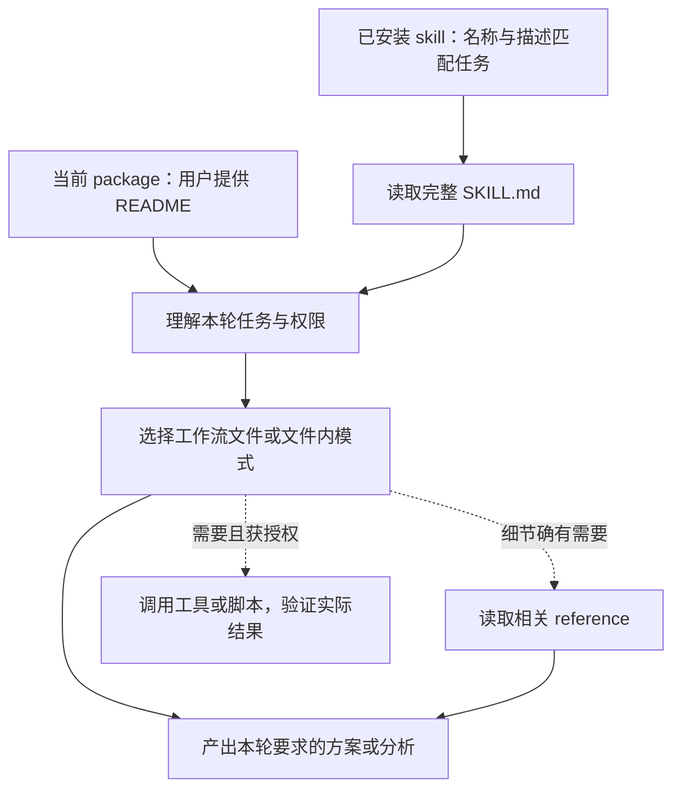

# Practice library review · 2026-09-17

## 0. 核心判断

目前是六个网页、五个 practice 文件夹，而不是六套已经独立验证成熟的 skills。产品定义与 UX 重构共用一个文件夹和通用方法，面向两种不同起点。

- **测试与评估**迭代最充分：工作流已分文件，并有按需方法参考和多轮用户提供的输出反馈。但当前行为测试案例尚未独立运行，不能称为已验证稳定。
- **产品定义与 UX 重构**有真实的既有可复用工作流支撑，不是补网页时才凭空写出的内容。优势是责任、状态、来源与恢复；风险是重复说明多、固定方案数量与交付清单可能让小任务变得过重。
- **产品研究与交付复盘**的主流程是在补齐页面时新写的。它们复用了已有库的方法，但尚未有同等程度的真实项目输出检验，适合作为受监督使用的 draft。
- **分析与实验**已具备较具体的事件、指标与实验契约；主要缺口是独立行为验证和不同数据成熟度下的可操作性，而不是缺更多术语。

建议先保留现有方法资产，用各模块代表性任务检验路由、输出和比例控制，再决定拆文件或增加方法。统一的页面样式只证明展示一致，不证明方法成熟度一致。

## 1. 哪些是原有资产，哪些是后来编写的？

依据：本地 Git 历史和当前文件引用。创建时间证明文件何时进入本仓库，不证明每段文字的最初作者、推导过程或实际使用效果。外部参考链接也不等于整套流程已经由该来源验证。

| 页面 | 可核实的既有支撑 | 后续新增 | 当前判断与主要风险 |
|---|---|---|---|
| 产品研究 | 通用重构方法、证据边界、上下文规范；连接测试和分析模块 | `56bfb01` 首次加入 README、研究工作流和网页 | 可用的研究初稿。问题→方法→证据→决策链清楚；访谈执行、不同领域的研究深度和停止标准尚未实测 |
| 产品定义 | 首次提交 `902b92d` 已有共享方法与新功能规划的中英文件 | `56bfb01` 增加网页与入口组织 | 结构覆盖充分。固定至少三个概念、16 项输出及完整系统边界列表可能造成过度展开 |
| UX 重构 | 首次提交 `902b92d` 已有共享方法与 MVP 重构的中英文件 | `56bfb01` 增加网页与入口组织 | 重新构想的立场明确，能触及系统责任。固定三方向和共享／专用流程重复，仍需小功能与成熟产品案例检验 |
| 测试与评估 | 首次提交已有完整方法、设计／审查入口、实施和运行流程 | 后续拆分设计与审查，增加四份按需方法参考，持续改进输出要求 | 当前迭代最深；方案可读性仍可能受到术语压缩和模型表达习惯影响。尚无当前版本的独立行为通过率 |
| 分析与实验 | 复用测试模块的证据与权限原则 | `18053b0` 增加入口；`8181ada` 增加独立方法、工作流与网页 | 方法具体，但五种模式同文件，尚非文件级按需加载；真实数据的完整分析结果未在此次验证 |
| 交付与复盘 | 通用重构的结构切片、AI 系统审查、测试与分析、上下文规范 | `56bfb01` 首次加入 README、交付工作流和网页 | 有用的编排初稿。需验证它能否准确复用相邻模块，而非重复审查或扩大交付范围 |

因此，对“后来补出的四页”而言，**两页包装已有核心工作流，另两页新增主流程并复用既有方法**。这不是内容复用百分比；不能用文件数推算方法质量或逐段来源。

## 2. 每一页的文件结构

每份图包含 Mermaid 源图、文件链接和用途。网页用同一份结构数据生成可点击的路由示意；无需外部图表服务。它们是当前指引的可视化，不是运行时访问记录。

- [产品研究](../prompts/product-research/file-map.md)
- [产品定义](../prompts/product-ux-rethinking/product-framing-map.md)
- [UX 重构](../prompts/product-ux-rethinking/ux-rethinking-map.md)
- [测试与评估](../prompts/testing-evaluation-system/file-map.md)
- [分析与实验](../prompts/product-analytics-experimentation/file-map.md)
- [交付与复盘](../prompts/delivery-learning/file-map.md)

共同约束位于 [task-contract.md](../prompts/_shared/task-contract.md)。HTML 是人的浏览入口，README 是当前交给 Agent 的入口；CSS、搜索索引和页面脚本负责展示，不是测试／研究／产品规划的执行 harness。

## 3. Package 路由与真正 skill 的运行方式

在 Codex 中，skill 名称和描述用于发现，选中后加载完整 `SKILL.md`，可由用户显式调用或按描述匹配。参考：[OpenAI 官方 skill 文档](https://learn.chatgpt.com/docs/build-skills)。其他宿主的发现和加载细节需分别确认。

当前本库没有用于这些模块的 `SKILL.md` 安装入口，靠复制指令显式读取 README。README 中的链接并不会像程序函数一样自动调用其他文件；Agent 根据任务、指引和可用工具决定如何继续读取。

- 测试模块的设计、审查、实施和运行已分文件，因而可以做到文件级按需读取。
- 研究、分析、交付主要在一个文件里区分模式。读取整个文件时会看到其他模式，之后应只执行相关部分；不能宣称无关内容一定未进入上下文。
- 产品定义与 UX 共用通用方法；通常选一条专业路线和一种语言。确有混合任务时可组合，但不默认两条全跑。
- 按需读取减少无关上下文，却不是权限隔离或确定性路由。实际读了哪些文件、是否越界，需要从工具轨迹和实际输出验证。

## 4. 本轮可读性改进

通用问题是：把完整行为压缩成陌生短标签、把评估对象与计数单位混成一列、只列方法名而不说明怎么做。它不限于某个业务领域，也不能靠把表头变简单解决。

本轮已把要求放进共享任务契约和测试模块的交付结构：

- 总览用普通语言表达建议、独立理由、关键不确定性与下一步。
- 检查描述包含输入或改动、观察对象、预期结果和决策用途。
- 分析单位只在影响理解时简要说明；正式单位、schema、评分与完整步骤保留在技术正文。
- 使用必要的专业术语并解释其作用，不制造让读者猜意思的压缩名词。
- 新增跨领域的文档编辑器行为案例，检查相同问题，而不把单一项目的规则写进通用库。

没有改写用户提供的项目输出，也没有把其他模块全部套用测试模块的四列表格。它们的具体输出仍由各自工作流决定。

## 5. 下一轮最有价值的验证

| 模块 | 代表性任务 | 观察什么 |
|---|---|---|
| 研究 | 没有访谈的研究规划；有互相矛盾访谈的归纳 | 是否直接交付可用方法；是否保留矛盾而不编造需求证据 |
| 产品定义 | 简单非 AI 功能；高风险 AI 功能 | 是否按问题选深度；是否为凑概念数而制造无意义方案 |
| UX 重构 | 小型局部摩擦；成熟但工程导向的多阶段产品 | 是否真正重构任务与责任；是否按成熟度控制改动强度 |
| 分析与实验 | 埋点不可靠；流量不足；有效实验结果 | 是否先验证数据，区分描述与因果，拒绝不成立的精确结论 |
| 交付与复盘 | 只要计划；已批准实施；只看发布就绪性 | 是否维持权限边界，复用相邻模块，避免自动部署 |

这些是建议的行为验证，不是已通过的结果。本次质量判断来自静态文件审查、Git 历史和用户反馈；页面与链接检查只覆盖打包和交互。
